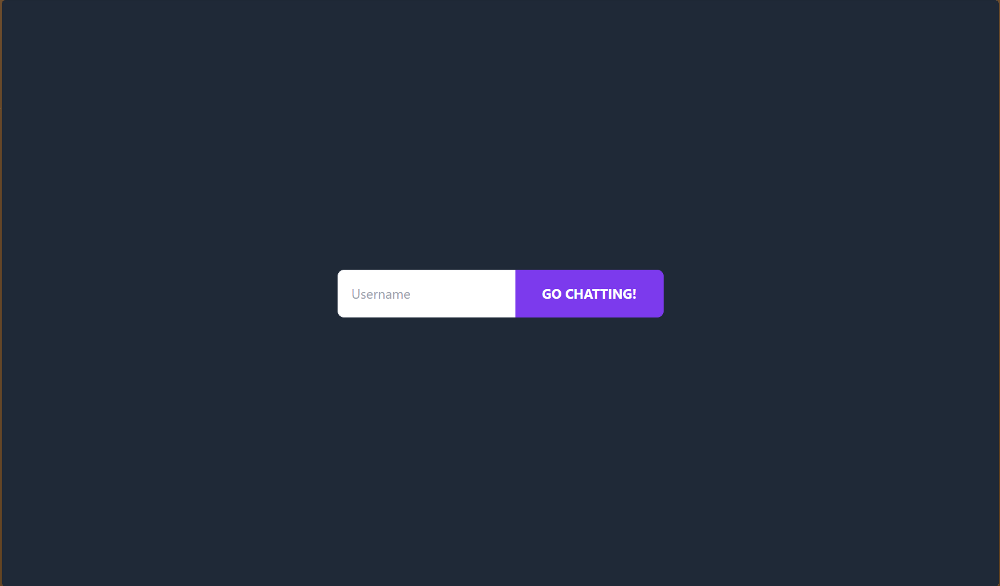
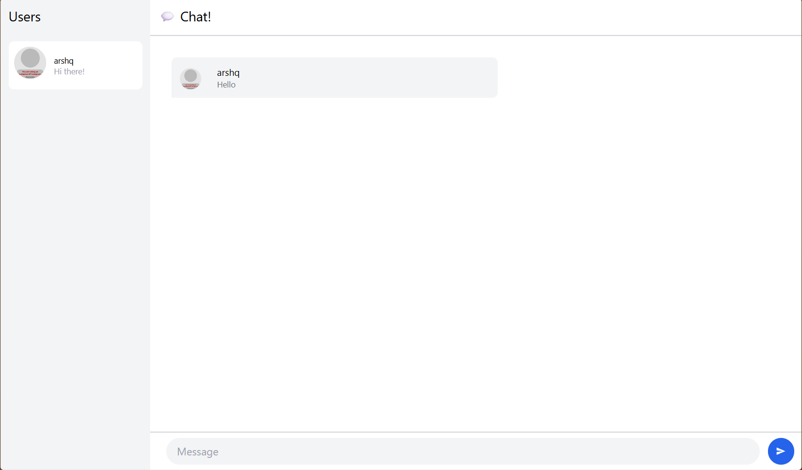

# Tutorial 10 - WebChat

> Source code for [Let’s Build a Websocket Chat Project With Rust and Yew 0.19 🦀](#)

## Run

1. Install the required toolchain dependencies:
   ```npm i```

2. Build docker image
   ```docker build -t yewchat .```

3. Run docker
   ```docker run -p 8000:8000 yewchat```

## 3.1. Original code


