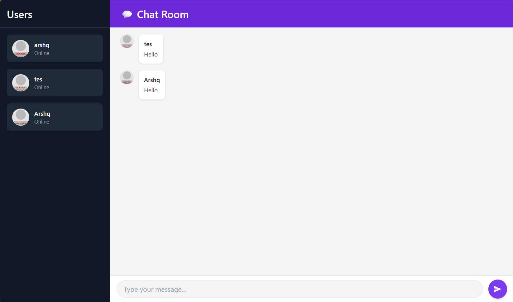

# Tutorial 10 - WebChat

> Source code for [Let’s Build a Websocket Chat Project With Rust and Yew 0.19 🦀](#)

## Run

1. Install the required toolchain dependencies:
   ```npm i```

2. Build docker image
   ```docker build -t yewchat .```

3. Run docker
   ```docker run -p 8000:8000 yewchat```

## 3.1. Original code


## 3.2. Add some creativities to the webclient


Untuk ini saya hanya mengubah style dari halaman chat agar tampil lebih modern dan menarik menggunakan kombinasi warna ungu (violet) dan nuansa gelap. Ini dilakukan dengan mengubah kode `html!{...}` pada kode chat.rs dengan tampilan html yang diinginkan.